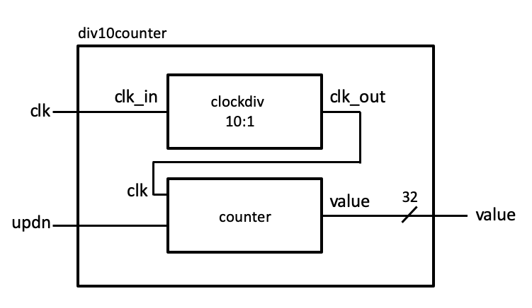

# systemverilog
Demonstrating systemverilog, verilator and google test for verification

This repo contains a complete example of how to use Verilator and Google
test to validate Systemverilog code. It has currently only been tested
on MacOS but should run fine on Linux.

## The div10counter example
The project consists of two systemverilog modules (clockdiv.sv, counter.sv)
and, in my terminology, a unit (div10counter.sv) which connects the two modules
to show how the testing methodology can be extended in a hierarchical manner.

### Makefile rules
The toplevel makefile uses macros to generate the dependencies so it is
very simple to add new modules and units to the system.

A (makefile) module is an independent systemverilog module not depending on
other modules. To add a module just append it to the MODULE list. For example

    MODULES = clockdiv counter mymod1 mymod2 mymod3

The requirement is that you have a corresponding test file in the
test/ directory.

A (makefile) unit is a (system)verilog module that instantiates one or more
(system)verilog modules. Here you both need to speficy the module AND its
dependencies:

    UNITS = div10counter
    UNITS.div10counter = src/modules/clockdiv.sv src/modules/counter.sv

## Building

To run Verilator and generate the test executables:

    > make

## Running tests
To run the test executables

    > make runtest

## Prerequisites
The project relies on git, g++, GNU Make, Google test and Verilator.

### Verilator
You can install Verilator using your favourite packet system or compile it from source

    > brew install verilator  (mac)
    > apt-get install verilator (ubuntu)

https://www.veripool.org/wiki/verilator

### First build
On the first build you need to compile googletest. But after that you don't
need to do that again.

    > make gtest
