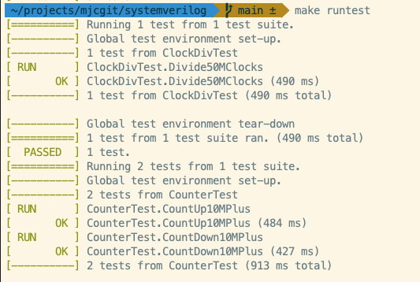
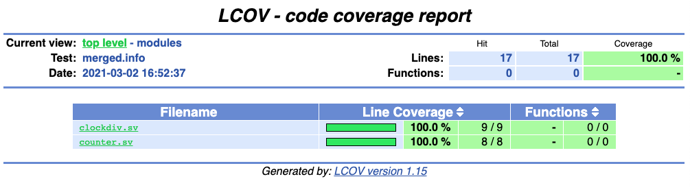
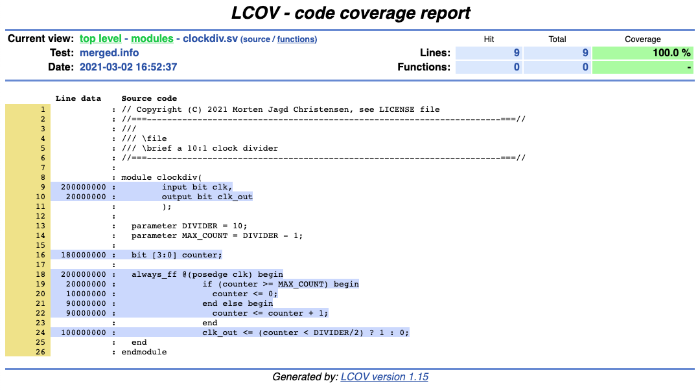

# SystemVerilog
Demonstrating a toolchain combining SystemVerilog, Verilator, GoogleTest
and test coverage for verification

This repo contains a complete example of how to use Verilator and GoogleTest
to validate Systemverilog code. It also demonstrates code coverage for
SystemVerilog modules. It has currently only been tested on MacOS but should
run fine on Linux.

## The div10counter example
The project consists of two Systemverilog modules (clockdiv.sv, counter.sv)
and - my own terminology - a unit (div10counter.sv) which connects the two modules
to show how the testing methodology can be extended in a hierarchical manner.

The clock divider just divides the system clock by 10. The counter gets
the divided clock (**clk**) and counts up or down on each clock depending
on the **updn** value. The counter output is 32-bit.

### Makefile rules
The toplevel makefile uses macros to generate the make dependencies so
the user needs not do a lot of makefile editing. The rules for doing this
are in **Makefile.macros**.

I have introduced the following makefile terminology: module and unit.

A (makefile) module is an independent SystemVerilog module not depending on
other SystemVerilog modules. To add a (makefile) module just append its name
to the MODULE list like this

    MODULES = clockdiv counter mymod1 mymod2 mymod3

The requirement is that src/modules/mymod1.sv exist and that you have a corresponding
mymod1_test.cpp file in the **test/** directory.

A (makefile) unit is a SystemVerilog module that instantiates one or more
SystemVerilog modules. Here you both need to specify the unit AND its
dependencies:

    UNITS = div10counter
    UNITS.div10counter = src/modules/clockdiv.sv src/modules/counter.sv

This requires that div10counter.sv exists (in src/units) and that there is a
corresponding div10ounter_test.cpp in test/.

## Building
To run Verilator and generate the test executables:

    > make

This runs Verilator with the -Wall option for 'linting' the code. It also
builds the test executables.

## Running tests
To run the test executables

    > make runtest

The output will look something like this

## Test coverage
It is possible to instrument the test code with test coverage functionality.
This means that after running the tests you can see which lines of your
SystemVerilog module where 'covered' during the test runs.

    > make genhtml

In the coverage report (logs/html/index.html) you get an overview of all the modules
and their line coverage.

You can also look closer at individual modules with an annotated view.

In this trivial example there is not much to see, but for more complicated
modules this should be a clear help to see if corner cases are missing.

## Prerequisites
The project relies on Git, g++, GNU Make, GoogleTest and Verilator. If you
want test coverage you also need genhtml which comes with the lcov package.

### Verilator
You can install Verilator (https://www.veripool.org/wiki/verilator) using your
favourite packet manager, for example

    > brew install verilator  (mac)
    > apt-get install verilator (ubuntu)

 .. or you can build it from source (https://github.com/verilator/verilator).

### First build
On the first build you need to clone and compile GoogleTest. But after that you don't
need to do that again.

    > make gtest

The GoogleTest files can be removed by

    > make realclean
